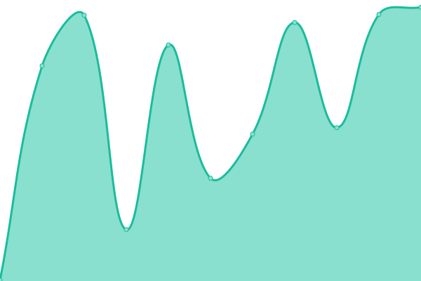
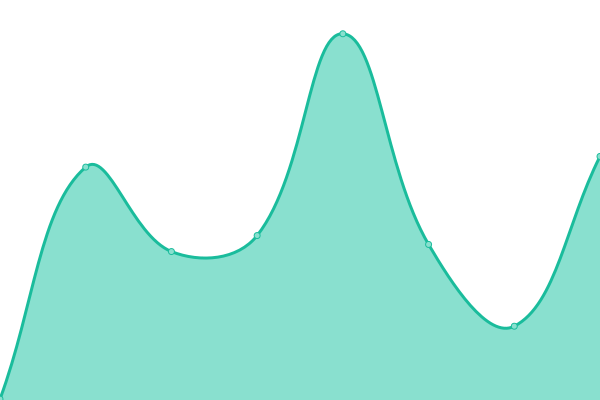

# [📈 Live Status](https://Software-and-Website-Developer-Team.github.io/Status): <!--live status--> **🟧 Partial outage**

This repository contains the open-source uptime monitor and status page for [Software and Website Developer Team](https://software-and-website-developer-team.github.io), powered by [Upptime](https://github.com/upptime/upptime).

With [Upptime](https://upptime.js.org), you can get your own unlimited and free uptime monitor and status page, powered entirely by a GitHub repository. We use [Issues](https://github.com/Software-and-Website-Developer-Team/Status/issues) as incident reports, [Actions](https://github.com/Software-and-Website-Developer-Team/Status/actions) as uptime monitors, and [Pages](https://Software-and-Website-Developer-Team.github.io/Status) for the status page.

<!--start: status pages-->
<!-- This summary is generated by Upptime (https://github.com/upptime/upptime) -->
<!-- Do not edit this manually, your changes will be overwritten -->
<!-- prettier-ignore -->
| URL | Status | History | Response Time | Uptime |
| --- | ------ | ------- | ------------- | ------ |
|  [Main Site](https://onefutureunifiedteam.tk/) | 🟩 Up | [main-site.yml](https://github.com/One-Future-Unified-Team/Status/commits/HEAD/history/main-site.yml) | 

 139ms
     
 | 

<a href="https://One-Future-Unified-Team.github.io/Status/history/main-site">100.00%</a>
    

|  [Web App](https://web-app.onefutureunifiedteam.tk/) | 🟩 Up | [web-app.yml](https://github.com/One-Future-Unified-Team/Status/commits/HEAD/history/web-app.yml) | 

 97ms
     
 | 

<a href="https://One-Future-Unified-Team.github.io/Status/history/web-app">100.00%</a>
    

|  [Documentation](https://documentation.onefutureunifiedteam.tk/) | 🟩 Up | [documentation.yml](https://github.com/One-Future-Unified-Team/Status/commits/HEAD/history/documentation.yml) | 

 134ms
     
 | 

<a href="https://One-Future-Unified-Team.github.io/Status/history/documentation">100.00%</a>
    

|  [Store](https://store.onefutureunifiedteam.tk/) | 🟩 Up | [store.yml](https://github.com/One-Future-Unified-Team/Status/commits/HEAD/history/store.yml) | 

 96ms
     
 | 

<a href="https://One-Future-Unified-Team.github.io/Status/history/store">100.00%</a>
    

|  [API](https://api.onefutureunifiedteam.tk/) | 🟩 Up | [api.yml](https://github.com/One-Future-Unified-Team/Status/commits/HEAD/history/api.yml) | 

 288ms
     
 | 

<a href="https://One-Future-Unified-Team.github.io/Status/history/api">100.00%</a>
    

|  [Partner](https://partner.onefutureunifiedteam.tk/) | 🟩 Up | [partner.yml](https://github.com/One-Future-Unified-Team/Status/commits/HEAD/history/partner.yml) | 

 268ms
     
 | 

<a href="https://One-Future-Unified-Team.github.io/Status/history/partner">100.00%</a>
    

|  [Forum](https://forum.onefutureunifiedteam.tk/) | 🟩 Up | [forum.yml](https://github.com/One-Future-Unified-Team/Status/commits/HEAD/history/forum.yml) | 

 277ms
     
 | 

<a href="https://One-Future-Unified-Team.github.io/Status/history/forum">100.00%</a>
    

|  [InfoHQ](https://infohq.onefutureunifiedteam.tk/) | 🟩 Up | [info-hq.yml](https://github.com/One-Future-Unified-Team/Status/commits/HEAD/history/info-hq.yml) | 

 275ms
     
 | 

<a href="https://One-Future-Unified-Team.github.io/Status/history/info-hq">100.00%</a>
    

|  [Staff](https://staff.onefutureunifiedteam.tk/) | 🟩 Up | [staff.yml](https://github.com/One-Future-Unified-Team/Status/commits/HEAD/history/staff.yml) | 

 264ms
     
 | 

<a href="https://One-Future-Unified-Team.github.io/Status/history/staff">100.00%</a>
    

|  [Workplace](https://workplace.onefutureunifiedteam.tk/) | 🟥 Down | [workplace.yml](https://github.com/One-Future-Unified-Team/Status/commits/HEAD/history/workplace.yml) | 

 265ms
     
 | 

<a href="https://One-Future-Unified-Team.github.io/Status/history/workplace">4.15%</a>
    

|  [Teenager Heroes](https://teenager-heroes.tk/) | 🟥 Down | [teenager-heroes.yml](https://github.com/One-Future-Unified-Team/Status/commits/HEAD/history/teenager-heroes.yml) | 

 258ms
     
 | 

<a href="https://One-Future-Unified-Team.github.io/Status/history/teenager-heroes">6.28%</a>
    

|  [PJ Masks Community](https://staff.onefutureunifiedteam.tk/) | 🟩 Up | [pj-masks-community.yml](https://github.com/One-Future-Unified-Team/Status/commits/HEAD/history/pj-masks-community.yml) | 

 16ms
     
 | 

<a href="https://One-Future-Unified-Team.github.io/Status/history/pj-masks-community">100.00%</a>
    

<!--end: status pages-->

[**Visit our status website →**](https://Software-and-Website-Developer-Team.github.io/Status)

## 📄 License

- Powered by: [Upptime](https://github.com/upptime/upptime)
- Code: [MIT](./LICENSE) © [Software and Website Developer Team](https://software-and-website-developer-team.github.io)
- Data in the `./history` directory: [Open Database License](https://opendatacommons.org/licenses/odbl/1-0/)
