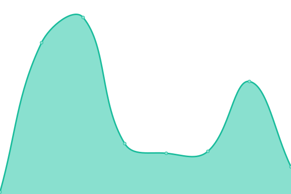
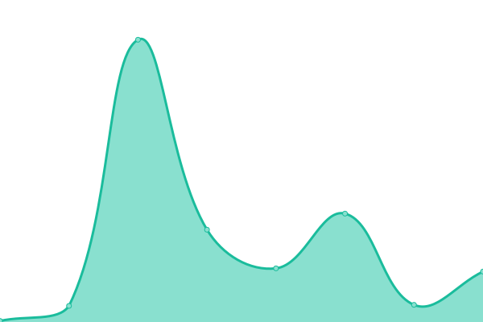
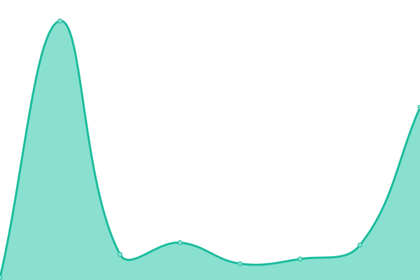

# [📈 Live Status](https://Software-and-Website-Developer-Team.github.io/Status): <!--live status--> **🟩 All systems operational**

This repository contains the open-source uptime monitor and status page for [Software and Website Developer Team](https://software-and-website-developer-team.github.io), powered by [Upptime](https://github.com/upptime/upptime).

With [Upptime](https://upptime.js.org), you can get your own unlimited and free uptime monitor and status page, powered entirely by a GitHub repository. We use [Issues](https://github.com/Software-and-Website-Developer-Team/Status/issues) as incident reports, [Actions](https://github.com/Software-and-Website-Developer-Team/Status/actions) as uptime monitors, and [Pages](https://Software-and-Website-Developer-Team.github.io/Status) for the status page.

<!--start: status pages-->
<!-- This summary is generated by Upptime (https://github.com/upptime/upptime) -->
<!-- Do not edit this manually, your changes will be overwritten -->
<!-- prettier-ignore -->
| URL | Status | History | Response Time | Uptime |
| --- | ------ | ------- | ------------- | ------ |
|  [Main Site](https://one-future-unified-team.github.io/) | 🟩 Up | [main-site.yml](https://github.com/One-Future-Unified-Team/Status/commits/HEAD/history/main-site.yml) | 

 107ms
     
 | 

<a href="https://One-Future-Unified-Team.github.io/Status/history/main-site">100.00%</a>
    

|  [Web App](https://one-future-unified-team.github.io/Web-App/) | 🟩 Up | [web-app.yml](https://github.com/One-Future-Unified-Team/Status/commits/HEAD/history/web-app.yml) | 

 57ms
     
 | 

<a href="https://One-Future-Unified-Team.github.io/Status/history/web-app">100.00%</a>
    

|  [Documentation](https://one-future-unified-team.github.io/Documentation/) | 🟩 Up | [documentation.yml](https://github.com/One-Future-Unified-Team/Status/commits/HEAD/history/documentation.yml) | 

 58ms
     
 | 

<a href="https://One-Future-Unified-Team.github.io/Status/history/documentation">100.00%</a>
    

|  [Store](https://one-future-unified-team.github.io/Store/) | 🟩 Up | [store.yml](https://github.com/One-Future-Unified-Team/Status/commits/HEAD/history/store.yml) | 

 55ms
     
 | 

<a href="https://One-Future-Unified-Team.github.io/Status/history/store">100.00%</a>
    

<!--end: status pages-->

[**Visit our status website →**](https://Software-and-Website-Developer-Team.github.io/Status)

## 📄 License

- Powered by: [Upptime](https://github.com/upptime/upptime)
- Code: [MIT](./LICENSE) © [Software and Website Developer Team](https://software-and-website-developer-team.github.io)
- Data in the `./history` directory: [Open Database License](https://opendatacommons.org/licenses/odbl/1-0/)
